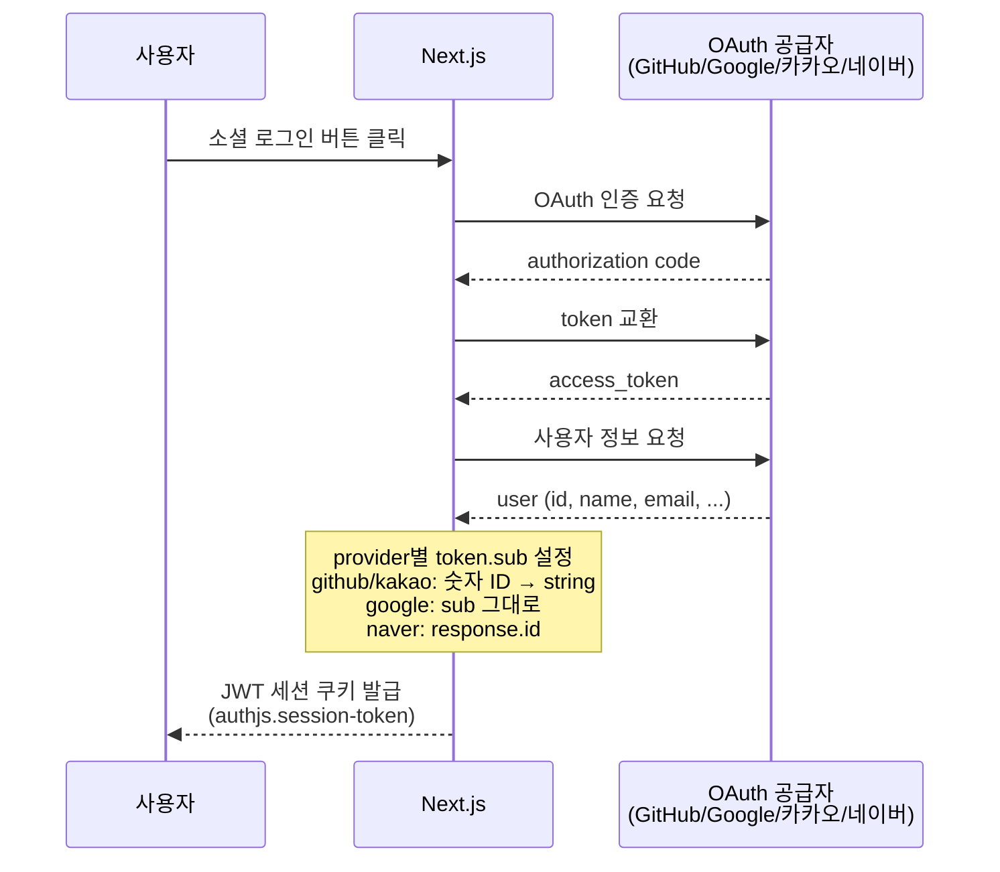

# 아키텍처 문서

## 기술 스택

| 영역 | 기술 | 버전 | 용도 |
|------|------|------|------|
| 프레임워크 | Next.js | 16.2.2 | App Router, API Route, SSR |
| UI 라이브러리 | React | 19.2.4 | 컴포넌트 |
| 스타일 | Tailwind CSS | v4 | 유틸리티 CSS |
| 데이터베이스 | Supabase (PostgreSQL) | - | 멤버 데이터, RLS |
| 인증 | next-auth v5 (beta) | 5.0.0-beta.30 | GitHub / Google / 카카오 / 네이버 OAuth, 세션 관리 |
| 배포 | Vercel | - | 서버리스 배포 |
| 테스트 | Vitest + Playwright | 3.2 / 1.59 | 단위·통합·E2E |
| 언어 | TypeScript | 5 | 전체 코드베이스 |

### 설계 원칙

- **서버 우선**: 데이터 페칭은 Server Component에서, 인터랙션만 Client Component
- **RLS로 데이터 보호**: Supabase RLS가 1차 방어선, API Route가 2차
- **이메일 보호**: `email_public` 플래그 + 세션 검사 후 API Route에서 필터링
- **서비스 롤 분리**: 클라이언트에는 anon key만 노출, 쓰기는 service role key

---

## DB 스키마

```sql
-- members 테이블
CREATE TABLE members (
  id            UUID PRIMARY KEY DEFAULT gen_random_uuid(),
  user_id       TEXT NOT NULL UNIQUE,   -- GitHub 사용자 ID (next-auth token.sub)
  name_ko       TEXT NOT NULL,
  name_en       TEXT,
  company       TEXT NOT NULL,
  role          TEXT,
  bio           TEXT,
  category      TEXT CHECK (category IN ('기업', '연구/공공', '학계')),
  email         TEXT,
  email_public  BOOLEAN DEFAULT FALSE,
  phone         TEXT,
  phone_public  BOOLEAN DEFAULT FALSE,
  linkedin      TEXT,
  github        TEXT,
  discord       TEXT,
  blog          TEXT,
  avatar_url    TEXT,
  tags          TEXT[] DEFAULT '{}',
  provider      TEXT DEFAULT 'github',
  approved      BOOLEAN DEFAULT FALSE,
  created_at    TIMESTAMPTZ DEFAULT now(),
  updated_at    TIMESTAMPTZ DEFAULT now()
);

-- admins 테이블 (운영진 권한)
CREATE TABLE admins (
  user_id   TEXT PRIMARY KEY,           -- GitHub 사용자 ID
  added_at  TIMESTAMPTZ DEFAULT now()
);
```

### RLS 정책

| 역할 | 테이블 | 정책 |
|------|--------|------|
| `anon` | members | `approved = true`인 행만 SELECT |
| `authenticated` | members | `approved = true`인 행만 SELECT |
| `anon` | admins | SELECT 불가 (`using (false)`) |
| service role | 모든 테이블 | RLS 우회 (API Route 전용) |

> INSERT / UPDATE / DELETE는 모두 서비스 롤을 통한 API Route에서만 허용됩니다.

### 인덱스 권장

```sql
CREATE INDEX idx_members_approved ON members (approved);
CREATE INDEX idx_members_name_ko  ON members (name_ko);
CREATE INDEX idx_members_company  ON members (company);
```

---

## 폴더 구조

```
kwg-directory/
├── src/
│   ├── app/                        # Next.js App Router
│   │   ├── layout.tsx              # 공통 레이아웃 (Navbar, Footer, 테마)
│   │   ├── page.tsx                # 홈 — 멤버 그리드 (Server Component)
│   │   ├── globals.css             # 전역 스타일, 디자인 토큰
│   │   ├── api/
│   │   │   ├── auth/[...nextauth]/ # OAuth 핸들러 (GitHub/Google/카카오/네이버)
│   │   │   ├── members/            # GET (목록), POST (등록)
│   │   │   ├── members/me/         # GET/PATCH/DELETE (본인 프로필)
│   │   │   ├── members/[id]/       # GET, PATCH, DELETE
│   │   │   ├── admin/members/      # 운영진 GET (대기), PATCH (승인/거절)
│   │   │   ├── admin/export/csv/   # GET (멤버 목록 CSV 다운로드)
│   │   │   └── upload/avatar/      # POST (프로필 사진 업로드)
│   │   ├── admin/                  # 어드민 승인 페이지
│   │   ├── profile/new/            # 3단계 프로필 등록 폼
│   │   ├── profile/edit/           # 프로필 수정 폼
│   │   └── privacy/                # 개인정보 처리방침
│   ├── components/
│   │   ├── Navbar.tsx              # 상단 네비게이션
│   │   ├── Footer.tsx              # 하단 푸터
│   │   ├── MemberGrid.tsx          # 검색·필터·카드 그리드 (Client)
│   │   ├── MemberCard.tsx          # 멤버 카드 (접근성 키보드 지원)
│   │   ├── MemberModal.tsx         # 멤버 상세 모달
│   │   ├── SearchBar.tsx           # 검색창 (300ms 디바운스)
│   │   ├── CategoryFilter.tsx      # 카테고리 필터 칩
│   │   ├── ProfileForm.tsx         # 3단계 프로필 폼
│   │   ├── AdminTable.tsx          # 어드민 승인 테이블
│   │   ├── AdminTabs.tsx           # 어드민 탭 UI
│   │   ├── AdminManagement.tsx     # 운영진 관리
│   │   ├── AvatarUpload.tsx        # 프로필 사진 업로드
│   │   ├── TagSelector.tsx         # 관심 분야 태그 선택
│   │   ├── FlashMessage.tsx        # 성공/오류 플래시 메시지
│   │   └── CsvDownloadButton.tsx   # CSV 다운로드
│   ├── lib/
│   │   ├── supabase.ts             # Supabase 클라이언트 (anon)
│   │   ├── supabase-admin.ts       # Supabase 서비스 롤 클라이언트
│   │   ├── admin.ts                # isAdmin() 유틸
│   │   ├── mock-data.ts            # 개발용 목 멤버 데이터
│   │   └── utils.ts                # cn(), getInitials(), filterMembers() 등
│   ├── types/
│   │   ├── member.ts               # Member, MemberFormData 타입
│   │   └── next-auth.d.ts          # session.user.id 타입 확장
│   ├── auth.ts                     # NextAuth 설정 (GitHub provider)
│   └── proxy.ts                    # 개발용 프록시 설정
├── src/tests/
│   ├── setup.ts                    # Vitest 전역 설정, Supabase mock
│   ├── unit/                       # 단위 테스트
│   └── integration/api/            # API Route 통합 테스트
├── e2e/                            # Playwright E2E 테스트
├── supabase/
│   ├── migrations/001_init.sql     # DB 초기 스키마 + RLS
│   └── tests/members_rls.test.sql  # pgTAP RLS 테스트
├── public/
│   └── robots.txt                  # noindex, nofollow
├── docs/                           # 프로젝트 문서
├── .github/                        # GitHub 템플릿 + CI
└── next.config.ts                  # 보안 헤더, 이미지 도메인 설정
```

---

## 인증 흐름



## 멤버 등록 흐름

```
사용자 → POST /api/members → auth() 세션 확인
                           → members 테이블에 approved=false로 삽입
                           → 운영진에게 검토 대기

운영진 → PATCH /api/admin/members → isAdmin() 확인
                                  → approved=true 업데이트 (승인)
                                  → 또는 레코드 삭제 (거절)

일반 조회 → GET /api/members → approved=true 필터링
                             → 비로그인: email=null, phone=null
                             → 로그인: email 포함
                             → 로그인 + phone_public=true: phone 포함

본인 프로필 → GET  /api/members/me → 본인 레코드 반환
            → PATCH /api/members/me → 프로필 수정 (이름 변경 시 재승인)
            → DELETE /api/members/me → 탈퇴 (레코드 삭제 후 로그아웃)
```
