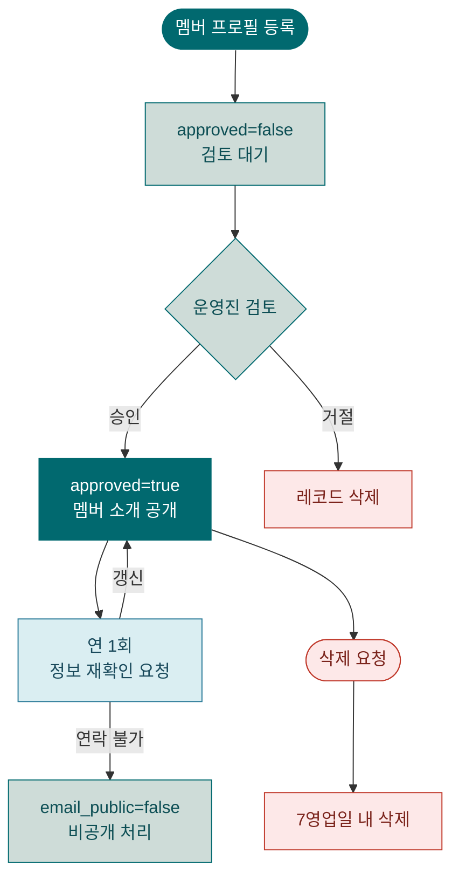

# 데이터 정책

KWG Directory에서 수집·처리하는 개인정보의 생명주기, 삭제 절차, 어드민 보안 정책을 안내합니다.

> 개인정보 처리방침(법적 고지)은 서비스 내 `/privacy` 페이지를 참고하세요.

---

## 데이터 생명주기



### 단계별 설명

| 단계 | 내용 | 주체 |
|------|------|------|
| 등록 | 폼 제출 → `approved=false`로 DB 저장 | 멤버 |
| 검토 | 운영진이 정보 확인 후 승인/거절 | 운영진 |
| 공개 | `approved=true` — 로그인 멤버에게 노출 | 자동 |
| 갱신 | 연 1회 이메일로 정보 재확인 요청 | 운영진 |
| 삭제 | 요청 접수 후 7영업일 내 처리 | 운영진 |

---

## 정보 삭제 요청 처리 절차

### 요청 접수

멤버가 아래 방법으로 삭제를 요청합니다:

- **이메일**: openchain-kwg-privacy@example.com
- **GitHub Issue**: `[삭제 요청]` 제목으로 등록 (비공개 정보 포함 시 이메일 권장)

### 처리 SQL

```sql
-- 1. user_id 확인 (GitHub 사용자명으로 조회)
SELECT id, user_id, name_ko, email, created_at
FROM members
WHERE name_ko = '요청자이름';

-- 2. members 테이블에서 삭제
DELETE FROM members WHERE user_id = '{github-numeric-id}';

-- 3. 삭제 확인
SELECT COUNT(*) FROM members WHERE user_id = '{github-numeric-id}';
-- 결과: 0
```

> **참고**: 이 프로젝트는 next-auth JWT 세션을 사용하므로 Supabase Auth 테이블에 별도 레코드가 없습니다. members 테이블 삭제만으로 개인정보 삭제가 완료됩니다.

### 처리 완료 확인 및 회신

1. 위 SQL로 삭제 확인 (결과 = 0)
2. 요청자에게 회신:
   ```
   안녕하세요.

   요청하신 개인정보가 {YYYY-MM-DD}에 삭제 처리되었습니다.
   이후 해당 정보는 KWG Directory 서비스에서 열람이 불가합니다.

   OpenChain KWG 운영진
   ```
3. 처리 기한: **7영업일 이내** (개인정보보호법 제36조)

---

## 소속 변경 처리

### 멤버 본인 직접 수정 (원칙)

1. 로그인 후 `/profile/new` 또는 프로필 수정 페이지 이용
2. 변경 후 운영진 재승인 불필요 (소속 변경은 자동 반영)

> 현재 프로필 편집 기능 미구현 시 아래 운영진 처리 절차 사용

### 운영진 직접 수정

멤버가 직접 수정이 어려운 경우:

```sql
-- 소속 변경
UPDATE members
SET company = '새 소속명', category = '새 카테고리', updated_at = now()
WHERE user_id = '{github-numeric-id}';

-- 연락 불가 멤버 비공개 처리
UPDATE members
SET email_public = false, updated_at = now()
WHERE user_id = '{github-numeric-id}';
```

---

## 어드민 계정 보안

### 원칙

- 어드민은 **최소 2인** 이상 유지 (단일 어드민 위험 방지)
- 어드민 목록 **반기별**(1월, 7월) 검토
- 어드민 계정 탈퇴 또는 조직 이탈 시 즉시 제거

### 어드민 목록 검토 절차

```sql
-- 현재 어드민 목록 확인
SELECT a.user_id, a.added_at
FROM admins a
ORDER BY a.added_at;
```

각 user_id에 대해:
1. GitHub 계정 활성 여부 확인: `https://api.github.com/users/{user_id_as_numeric}`
2. KWG 활동 지속 여부 확인
3. 비활성 어드민 제거:
   ```sql
   DELETE FROM admins WHERE user_id = '{비활성-user-id}';
   ```

자세한 SQL 스크립트: `scripts/transfer-admin.sql`
