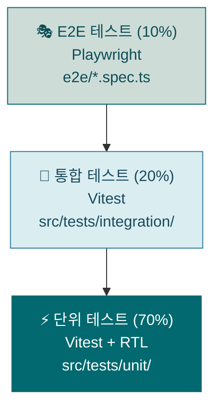
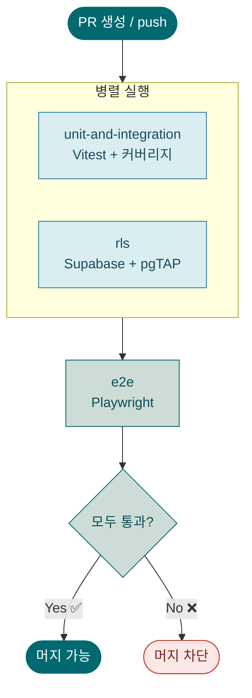

# 테스트 전략

## 개요

KWG Directory는 3계층 테스트 피라미드를 따릅니다.



| 계층 | 비율 | 도구 | 대상 |
|------|------|------|------|
| 단위 | 70% | Vitest + React Testing Library | 컴포넌트, 유틸 함수 |
| 통합 | 20% | Vitest (API Route mock) | API Route 인증·데이터 흐름 |
| E2E | 10% | Playwright (Chromium) | 핵심 사용자 시나리오 |
| RLS | 별도 | pgTAP (Supabase 에뮬레이터) | DB 접근 제어 정책 |

---

## 테스트 실행 방법

```bash
# 단위·통합 테스트 (빠른 피드백)
npm test

# 개발 중 watch 모드 (파일 변경 감지)
npm run test:watch

# 커버리지 리포트 (임계값 70%)
npm run test:coverage

# E2E 테스트 (개발 서버 자동 시작)
npm run test:e2e

# PR 게이트용 핵심 E2E만 실행
npm run test:e2e:gate

# 확장 E2E(야간/릴리즈 전)
npm run test:e2e:extended

# 레거시 E2E 확인용
npm run test:e2e:legacy

# 프로덕션 스모크 (읽기 전용)
npm run test:e2e:smoke:prod

# E2E 인터랙티브 UI 모드
npm run test:e2e:ui

# RLS 정책 테스트 (Supabase CLI 필요)
npm run test:rls

# 전체 실행 (unit + e2e)
npm run test:all
```

### 커버리지 임계값

`vitest.config.ts` 기준 — 미달 시 CI 실패:

| 항목 | 임계값 |
|------|--------|
| Lines | 70% |
| Functions | 70% |
| Branches | 70% |
| Statements | 70% |

---

## 파일 구조

```
src/tests/
├── setup.ts                      # 전역 설정, Supabase mock
├── unit/
│   ├── MemberCard.test.tsx        # 컴포넌트 단위 테스트
│   ├── CategoryFilter.test.tsx
│   ├── SearchBar.test.tsx
│   └── utils.test.ts              # 유틸 함수 테스트
└── integration/
    └── api/
        ├── members.test.ts        # GET/POST /api/members
        └── auth.test.ts           # 관리자 인증 흐름

e2e/
├── fixtures/
│   ├── auth.ts                    # NextAuth v5 세션 쿠키 mock (encode 사용)
│   └── supabase.ts                # 테스트 데이터 헬퍼 (createTestMember 등)
├── global-setup.ts                # 테스트 어드민 삽입, test-avatar.jpg 생성
├── global-teardown.ts             # 테스트 데이터 정리
├── 01-auth.spec.ts                # T01~T03: 로그인 검증
├── 02-profile.spec.ts             # T04~T06: 프로필 등록 검증
├── 03-admin.spec.ts               # T07~T09: 어드민 승인 검증
├── 04-directory.spec.ts           # T10~T13: 멤버 목록 검증
├── 05-mobile.spec.ts              # T14~T17: 모바일 레이아웃 검증
├── directory.spec.ts              # (레거시) 비로그인 히어로 시나리오
├── profile-form.spec.ts           # (레거시) 비로그인 프로필 접근
└── admin.spec.ts                  # (레거시) 비인증 /admin 접근

supabase/tests/
└── members_rls.test.sql           # pgTAP RLS 정책 테스트
```

### E2E 시나리오 (T01~T33)

| ID | 파일 | 시나리오 | Supabase 필요 | 세트 |
|----|------|----------|:---:|:---:|
| T01 | 01-auth | GitHub 로그인 버튼 표시 및 OAuth 리디렉션 확인 | ✗ | gate |
| T02 | 01-auth | 세션 mock 주입 후 로그인 상태 UI 전환 확인 | ✗ | extended |
| T03 | 01-auth | 로그아웃 후 세션 만료 및 로그인 버튼 재표시 | ✗ | gate |
| T04 | 02-profile | 프로필 등록 전체 흐름 (아바타 + 태그, API mock) | ✓ | extended |
| T05 | 02-profile | 필수값(이름 한글) 미입력 시 제출 버튼 비활성 | ✗ | gate |
| T06 | 02-profile | 로그인 후 Navbar에 프로필 관련 링크 표시 | ✗ | extended |
| T07 | 03-admin | 어드민 — 미승인 멤버 표시 및 승인 처리 | ✓ | extended |
| T08 | 03-admin | 일반 사용자의 /admin 접근 차단 | ✗ | gate |
| T09 | 03-admin | 비로그인 상태의 /admin 접근 시 홈 리디렉션 | ✗ | gate |
| T10 | 04-directory | 승인된 멤버 카드 표시 및 모달 열기/닫기 | ✓ | extended |
| T11 | 04-directory | 미승인 멤버 카드 비표시 | ✓ | extended |
| T12 | 04-directory | 비로그인 상태 — 이메일·전화번호 API 비반환 | ✗ | extended |
| T13 | 04-directory | 로그인 상태 — 이메일 표시 및 phone_public 조건 확인 | ✓ | extended |
| T18 | 06-search | 이름으로 검색 → 결과 필터링 | ✓ | extended |
| T19 | 06-search | 소속으로 검색 → 결과 필터링 | ✓ | extended |
| T20 | 06-search | 검색어 초기화 → 전체 목록 복원 | ✓ | extended |
| T21 | 03-admin | 거절 버튼 → 사유 선택 모달 → 거절 확정 | ✓ | extended |
| T22 | 04-directory | 미등록 로그인 사용자 → NotRegisteredScreen 표시 | ✗ | extended |
| T23 | 04-directory | 미승인 로그인 사용자 → PendingApprovalScreen 표시 | ✓ | extended |
| T24 | 04-directory | 승인된 사용자 → 멤버 목록 표시 | ✓ | extended |
| T25 | 04-directory | 관리자는 미등록 상태여도 멤버 목록 접근 가능 | ✓ | extended |
| T26 | 05-mobile | 모바일 네비게이션 — 아이콘만 표시 | ✓ | extended |
| T27 | 05-mobile | 모바일 멤버 카드 단일 컬럼 레이아웃 | ✓ | extended |
| T28 | 05-mobile | 모바일 모달 — 하단 bottom sheet 형태 | ✓ | extended |
| T29 | 05-mobile | 모바일 프로필 폼 — 필수 필드 표시 및 제출 버튼 상태 | ✗ | extended |
| T30 | 02-profile | 프로필 등록 API 실패 시 에러 메시지 표시 | ✗ | extended |
| T31 | 02-profile | 등록 버튼 더블클릭 시 중복 요청 방지 | ✗ | extended |
| T32 | 01-auth | Google 로그인 버튼 표시 및 OAuth 리디렉션 확인 | ✗ | gate |
| T33 | 01-auth | 개인정보 처리방침 링크 접근 가능 | ✗ | gate |

> Supabase 필요 = ✓인 테스트는 `supabaseAvailable` 플래그로 CI 환경에서 자동 skip됩니다.

---

## E2E 세션 Mock 패턴

Playwright 테스트에서 GitHub OAuth 없이 NextAuth v5 세션을 주입합니다.

```ts
// e2e/fixtures/auth.ts
import { encode } from 'next-auth/jwt'
import type { Page } from '@playwright/test'

export async function loginAsUser(page: Page) {
  const token = await encode({
    token: { name: '테스트유저', email: 'e2e@test.com', sub: 'test-user-id', provider: 'github' },
    secret: process.env.NEXTAUTH_SECRET!,
    salt: 'authjs.session-token',
  })
  await page.context().addCookies([{
    name: 'authjs.session-token', value: token,
    domain: 'localhost', path: '/', httpOnly: true, secure: false, sameSite: 'Lax',
  }])
}
```

`encode` 함수는 NextAuth v5 내부와 동일한 JWE 방식으로 토큰을 암호화하므로 서버 컴포넌트의 `auth()` 호출에서도 세션으로 인식됩니다.

---

## Supabase Mock 패턴

단위·통합 테스트에서 Supabase 클라이언트를 mock 처리합니다.

### 전역 mock (src/tests/setup.ts)

```ts
import { vi } from 'vitest'

vi.mock('@/lib/supabase-admin', () => ({
  createAdminClient: vi.fn(() => ({
    from: vi.fn(() => ({
      select: vi.fn().mockReturnThis(),
      insert: vi.fn().mockReturnThis(),
      update: vi.fn().mockReturnThis(),
      delete: vi.fn().mockReturnThis(),
      eq: vi.fn().mockReturnThis(),
      order: vi.fn().mockResolvedValue({ data: [], error: null }),
      single: vi.fn().mockResolvedValue({ data: null, error: null }),
      maybeSingle: vi.fn().mockResolvedValue({ data: null, error: null }),
    })),
  })),
}))
```

### 테스트별 오버라이드

```ts
import { createAdminClient } from '@/lib/supabase-admin'

const mockCreateAdminClient = vi.mocked(createAdminClient)

it('멤버 목록 반환', async () => {
  const chain = {
    select: vi.fn().mockReturnThis(),
    eq: vi.fn().mockReturnThis(),
    order: vi.fn().mockResolvedValue({ data: mockMembers, error: null }),
  }
  mockCreateAdminClient.mockReturnValue({ from: vi.fn(() => chain) } as never)

  const res = await GET()
  expect(res.status).toBe(200)
})
```

### RLS 테스트에 로컬 에뮬레이터를 사용하는 이유

단위 테스트의 Supabase mock은 PostgreSQL RLS 정책을 실제로 실행하지 않습니다. RLS는 DB 레벨에서 동작하므로 실제 PostgreSQL이 필요합니다. `supabase start`로 로컬 에뮬레이터를 시작하면 프로덕션과 동일한 RLS 정책 환경에서 pgTAP 테스트를 실행할 수 있습니다.

```bash
# Supabase CLI로 로컬 에뮬레이터 시작
supabase start

# pgTAP 테스트 실행
npm run test:rls

# 에뮬레이터 종료
supabase stop
```

---

## 테스트 작성 가이드 (기여자용)

### 새 컴포넌트 추가 시

단위 테스트 **필수** — `src/tests/unit/{ComponentName}.test.tsx`

최소 체크 항목:
- [ ] 기본 렌더링 (이름, 소속 등 props 표시)
- [ ] 인터랙션 (onClick, onKeyDown 등 이벤트)
- [ ] 접근성 (role, aria-label 속성)
- [ ] 조건부 렌더링 (없는 데이터일 때 처리)

```tsx
import { describe, it, expect, vi } from 'vitest'
import { render, screen } from '@testing-library/react'
import userEvent from '@testing-library/user-event'
import NewComponent from '@/components/NewComponent'

describe('NewComponent', () => {
  it('기본 정보가 렌더링된다', () => {
    render(<NewComponent data={mockData} />)
    expect(screen.getByText('예상 텍스트')).toBeInTheDocument()
  })
})
```

### 새 API Route 추가 시

통합 테스트 **필수** — `src/tests/integration/api/{route}.test.ts`

최소 체크 항목:
- [ ] 인증된 사용자 성공 케이스
- [ ] 비인증 사용자 401 응답
- [ ] 유효하지 않은 입력 400 응답
- [ ] DB 에러 시 500 응답

### DB 스키마 변경 시

RLS 테스트 **필수** — `supabase/tests/members_rls.test.sql`에 케이스 추가:
- [ ] anon 역할의 신규 컬럼 접근 제한 여부
- [ ] authenticated 역할의 접근 범위
- [ ] 신규 정책의 올바른 동작

### 핵심 사용자 흐름 변경 시

E2E 테스트 갱신 — `e2e/` 내 해당 spec 파일 수정:
- [ ] 변경된 시나리오 시나리오 업데이트
- [ ] 셀렉터가 실제 DOM과 일치하는지 확인

---

## GitHub Actions CI 연동

PR 머지 전 CI가 자동으로 실행됩니다.



### Job 구성

| Job | 선행 조건 | 내용 |
|-----|-----------|------|
| `lint` | 없음 | ESLint + 타입 검사 + testId 검사 |
| `test` | 없음 | Vitest 단위/통합 + 커버리지 |
| `rls` | 없음 | Supabase 에뮬레이터 + pgTAP |
| `build` | `lint`, `test` | Next.js 빌드 검증 |
| `e2e-gate` | `build` | PR 게이트용 Playwright 핵심 세트 |
| `e2e-smoke-prod` | `e2e-gate` | main push 후 프로덕션 스모크 |

CI 설정 파일: `.github/workflows/ci.yml`

### 실패 시 대처

1. **unit-and-integration 실패**: `npm run test:coverage` 로컬 실행 후 오류 확인
2. **rls 실패**: `supabase start && npm run test:rls` 로컬 실행 후 SQL 확인
3. **e2e 실패**: GitHub Actions 아티팩트에서 `playwright-report` + `playwright-screenshots-videos` 다운로드 후 스크린샷·비디오·트레이스 확인

---

## E2E 세트 분리 운영

### Gate 세트 (`@gate`)

- 목적: PR 병합 전 필수 회귀 차단
- 대상: `T01`, `T03`, `T05`, `T08`, `T09`, `T32`, `T33`
- 실행 명령: `npm run test:e2e:gate`

### Extended 세트 (`@extended`)

- 목적: 권한/상태전이/조합/모바일 등 심화 탐지
- 실행 명령: `npm run test:e2e:extended`
- 권장 주기: 야간 1회 + 릴리즈 전 1회
- 참고: Supabase 의존 시나리오(`test.skip(!supabaseAvailable, ...)`)는 Extended에서 운영

### Legacy 세트 (`@legacy`)

- 목적: 이전 시나리오 참조 및 점진 폐기 관리
- 실행 명령: `npm run test:e2e:legacy`
- 정책: 신규 기능 검증에는 사용하지 않음

### Production Smoke (`@smoke`)

- 목적: 배포 URL 기본 가용성과 OAuth 진입선 점검
- 실행 명령: `npm run test:e2e:smoke:prod`
- 기본 URL: `https://kwg-directory.vercel.app/`
- 제약: 실제 OAuth 완료/쓰기 동작(개인정보 변경, 삭제) 금지

---

## E2E 실패 triage 가이드

1. `playwright-report/index.html`에서 실패 단계와 trace 확인
2. `test-results/`에서 스크린샷과 비디오 확인
3. 실패 유형 라벨링
   - `selector`: locator 변경/접근성 속성 누락
   - `timing`: 비동기 상태 반영 지연
   - `data`: 시딩/정리 실패, 테스트 데이터 충돌
   - `env`: Supabase/OAuth/네트워크 환경 차이
4. 원인 미분류 상태로 재시도 금지 (문서에 분류 후 수정)
